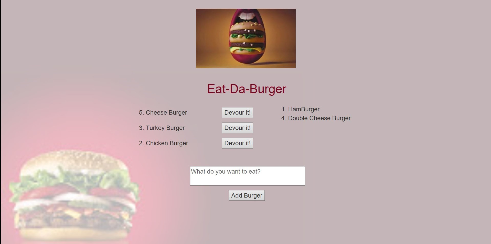

# Eat-Da-Burger
Eat-Da-Burger! is a restaurant app that lets users input the names of burgers they'd like to eat

---

## Technologies Used 

- Node.js
- MySQL Workbench 
- Node Packages (express, mysql, express-handlebars, body-parser)
- HTML Templating done with the help of Handlebars 
- Styling with CSS and elements of Materialize

---

## Live Link 
The demo of the burger eating application can be found by clicking [here](https://secret-lake-55615.herokuapp.com/).

or entering https://secret-lake-55615.herokuapp.com/ is your browser.

---

## How It Works

1. The user can submit a burger's name in the text box above the *`Add Burger`* `button`
2. On clicking *`Add Burger`* `button` the the app will display 
    * The burger's  name just entered and the position number in the database on the left side of the screen (above the text box).
    * A button alongside the burger name called `Devour it!`

3. The user can click on `any` one of the `Devour it!` buttons.  On clicking a `Devour it!` button
    * The corresponding burger's name will move to the right side of the screen
    * The clicked `Devour it!` button will disappear
    * Essentially indicating to the user that *`the burger was devoured!`*

4. The app will store every burger in a database, whether devoured or not.



---

#### Directory structure

All the recommended files and directories should look like the following structure:

```
.
├── config
│   |── connection.js
|   └── orm.js
│ 
├── controllers
│   └── burgers_controller.js
│
├── db
│   ├── schema.sql
│   └── seeds.sql
│
├── models
│   └── burger.js
│ 
├── node_modules
│ 
├── public
│   ├── assets
│   │   ├── css
│   │   │   └── style.css
│   │   ├── img
│   │   │   └── ...
│   │   └── js
│   │       └── burgers.js
│   └── test.html
│
├── views
|   ├── layouts
|   |    └── main.handlebars
|   |
|   ├── partials
|   |    └── burgers
|   |           └── burger-block.handlebars
|   |
|   └── index.handlebars
│
├── package-lock.json
├── package.json
├── server.js
└── README.md
```

## Local Installation

To run the application locally, first clone this repository with the following command.

	git clone "https://github.com/keanamaral/Eat-Da-Burger.git"
	
Next, install the application dependencies.

	cd eat-da-burger
	npm i
	
Finally, run the node server locally.

	node .\server.js
	
Now, open the local application in internet browser on port 8475 at the URL: `http://localhost:8475/`.

**Enjoy and have a burger!**